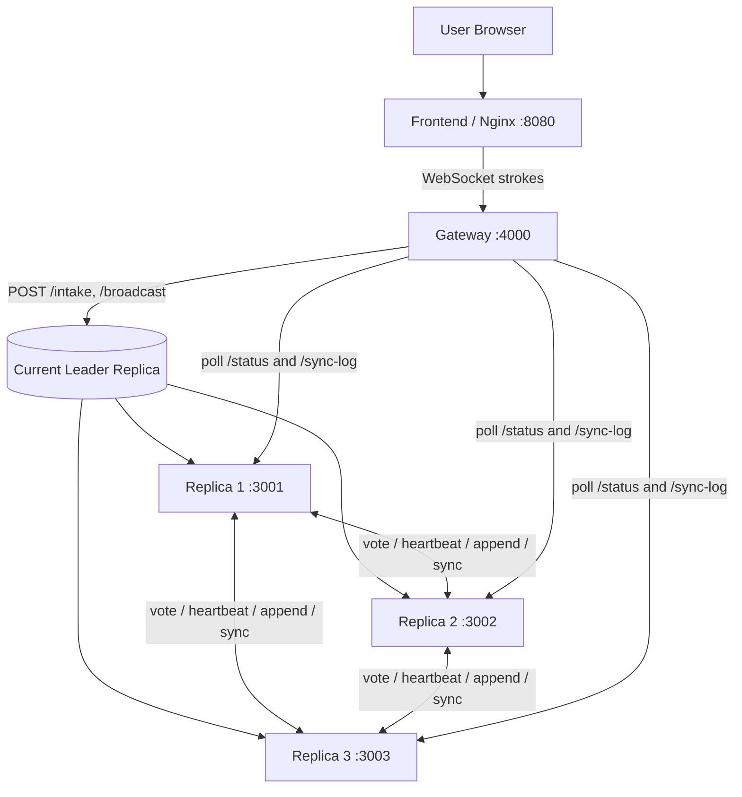

# MiniRaft Architecture

## Flow

1. The browser opens the frontend at port `8080`.
2. The frontend sends drawing strokes to the gateway over WebSocket.
3. The gateway finds the active leader and forwards each stroke for intake.
4. The leader replicates committed entries to follower replicas.
5. The gateway polls replica status and sync endpoints so connected clients stay updated during leader changes.
